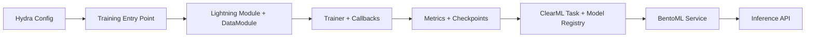
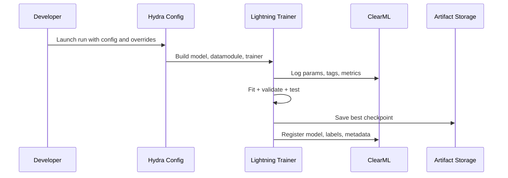
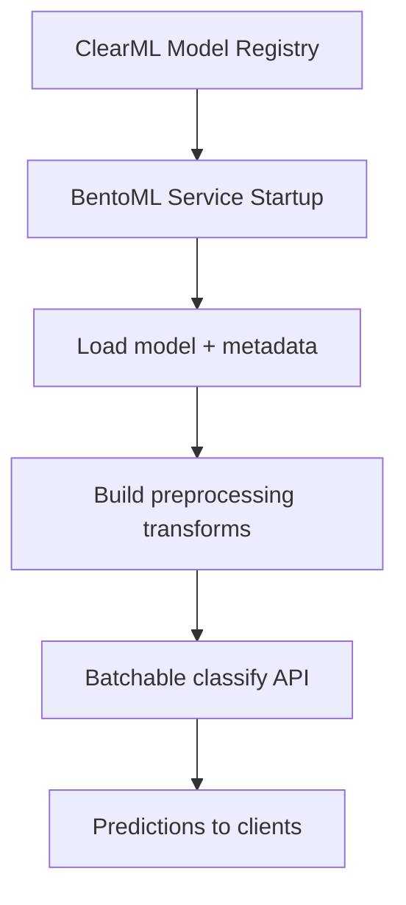

# Image Classification MLOps Blueprint

This repository is intentionally small in scope (fruit classification) and big in engineering signal.

The goal is to showcase a production-minded ML workflow where experimentation, reproducibility, and serving are treated as first-class concerns from day one.

## Why This Project Exists

Most ML demos optimize for "it runs once." This project optimizes for:

- Repeatable experiments through strongly structured Hydra configuration
- Traceable training and artifacts with ClearML tracking and model registry
- Clean training abstractions via PyTorch Lightning
- Fast, deterministic dependency management with uv
- Deployment-ready inference services with BentoML, keeping model serving concerns decoupled from generic web APIs

## Core Philosophy

### 1) Config-First Engineering (Hydra)

The training stack is organized around composable configuration, not scattered constants.

- Experiment settings are grouped by domain: project, module, datamodule, trainer
- Overrides are simple and explicit at runtime
- Multi-run sweeps become reproducible configuration graphs, not ad hoc scripts

Hydra provides a reliable contract between code and experiment intent.

### 2) Experiment Traceability and Artifact Lineage (ClearML)

Every meaningful training run should be inspectable later.

- Hyperparameters are attached to each run
- Metrics are logged and comparable across runs
- Model artifacts and metadata are versioned and retrievable
- Remote execution is supported with ClearML queues

This turns experimentation into an auditable process.

### 3) Structured Training Lifecycle (PyTorch Lightning)

Model code focuses on model behavior; orchestration is delegated to Lightning.

- Built-in trainer lifecycle and callback system
- Standardized logging and checkpointing hooks
- Optional tuning support (batch-size scaling and LR finder)
- Cleaner transition from research loops to robust pipelines

### 4) Reproducible Dependency Management (uv)

Dependency management should be fast and predictable.

- Minimal setup overhead
- Reproducible environment resolution
- Quick iteration when onboarding or validating runs

### 5) Model Serving as an Independent Runtime Layer (BentoML)

This project uses BentoML for model API serving to enforce service boundaries.

- Model lifecycle and inference API are packaged as a model service
- Inference service can evolve independently from a product web server
- Better alignment with future scaling, model versioning, and ops automation

Compared with embedding model endpoints directly into a generic web framework, this approach keeps ML serving explicit and decoupled.

## Project Perspective

This repository emphasizes engineering discipline alongside model performance.

The strongest signal here is the system design mindset:

- Config and runtime concerns are explicit and composable
- Training lifecycle is standardized and observable
- Experimentation is reproducible and traceable
- Serving path is decoupled and deployment-oriented

The design choices prioritize reproducibility, observability, and clear operational boundaries for model development and deployment.

## Architecture Overview



## Training and MLOps Flow



## Serving Flow



## Repository Structure

```text
src/
  train_image_classifier.py      # Hydra entrypoint, ClearML orchestration, training loop
  configs/
    image_classifier.py          # Structured config dataclasses
    image_classifier_config.yaml # Hydra defaults and runtime behavior
  datamodules/
    image_classifier.py          # LightningDataModule and dataset loading strategy
  models/
    image_classifier.py          # LightningModule + metrics + optimizer/scheduler setup
  bentoml/
    service.py                   # BentoML inference service
```

## Dataset Format

The datamodule expects an image-folder dataset rooted at a base directory that contains exactly three split folders:

- `train`
- `val`
- `test`

Inside each split, each class must have its own folder named with the class label, containing that class images.

```text
<dataset_root>/
  train/
    <class_name_1>/
      image_001.jpg
      image_002.jpg
    <class_name_2>/
      image_003.jpg
  val/
    <class_name_1>/
      image_101.jpg
    <class_name_2>/
      image_102.jpg
  test/
    <class_name_1>/
      image_201.jpg
    <class_name_2>/
      image_202.jpg
```

Notes:

- Class folder names are used as labels.
- The same class set should be present across `train`, `val`, and `test`.
- Point `datamodule_config.dataset_path_or_id` to `<dataset_root>`.

## Quick Start

### Prerequisites

- Python 3.12+
- uv

### Install Dependencies

```bash
uv sync
```

### Run Training

```bash
uv run python src/train_image_classifier.py
```

### Run With Hydra Overrides

```bash
uv run python src/train_image_classifier.py module_config.model_id=resnet34.a1_in1k trainer_config.max_epochs=50 datamodule_config.batch_size=128
```

### Enable Remote ClearML Execution

```bash
uv run python src/train_image_classifier.py project_config.execute_remotely=true project_config.execution_queue=default
```
